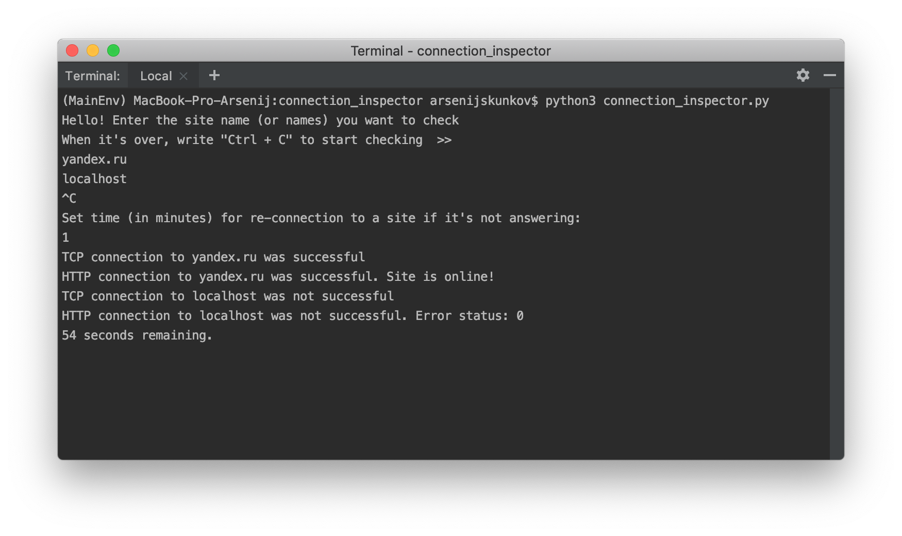

# Connection Inspector
It's a python program I wrote for practice. It allows user to check site status using TCP or HTTP.

macOS: If you want to test it on a computer running macOS, you need to update certificates. 
You can do it with following commands (just write it in Terminal):

Install Certificates.command
Update Shell Profile.command 
